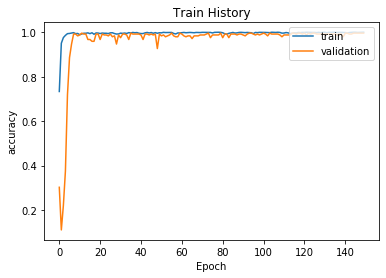
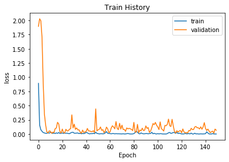
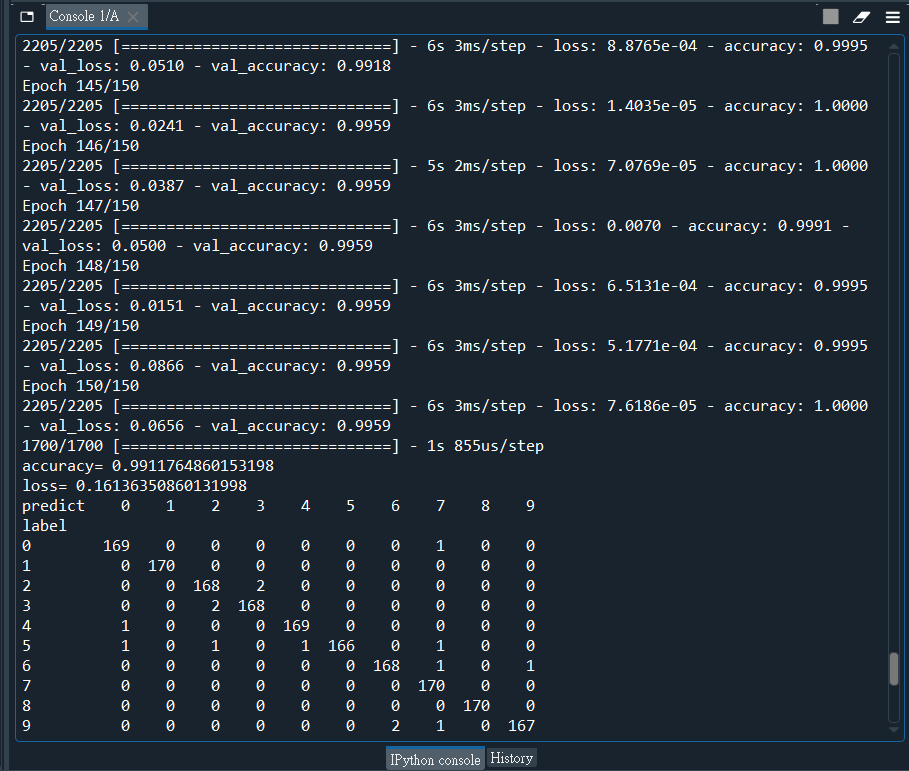
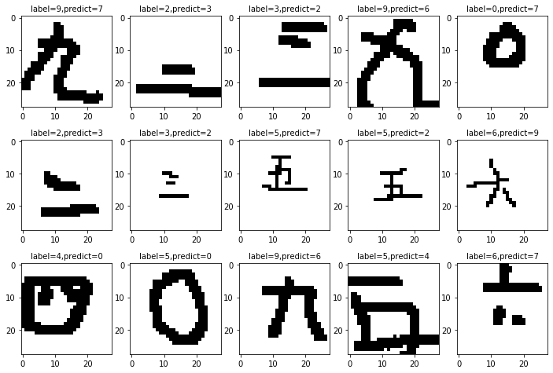

# Chinese_Handwritten_Digits_Recognition
a CNN digits recognition project

### Library and package
Python TensorFlow + Keras API

### IDE
Anaconda Spyder

#### Train history

#### Test Result
Test accuracy = 0.9911

#### Wrong Predict Image

